# HoopersHub
**HoopersHub** is a mobile app created using the **Javascript React Native framework**. It consists of 28 screens and deals with **basketball**. The app can work on android as well as ios devices. The **main** screen of the application is the following:  

    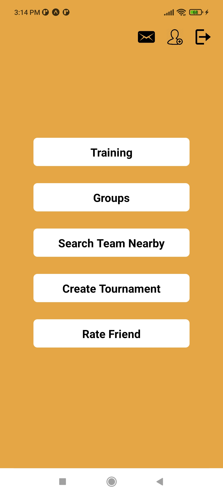 

 

Τhe **functions** of the application are the following:  

## Login/Register
First of all a user can create an account or log in to it. All user's data are stored to a firebase cloud database (firestore).

    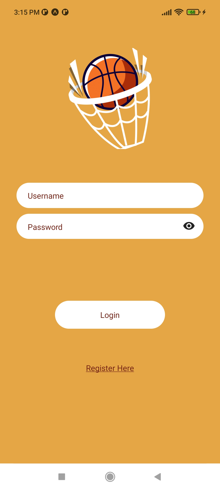
    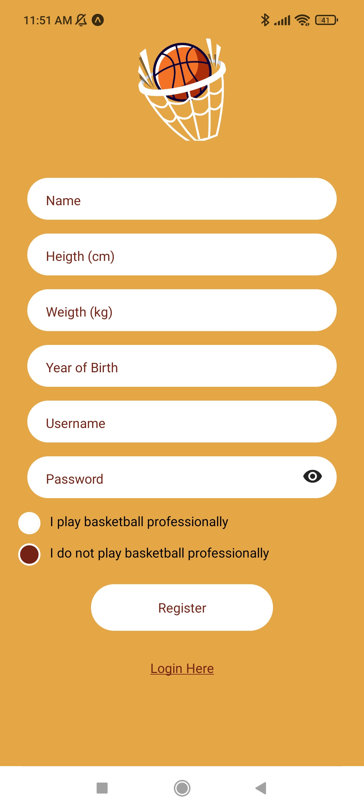 

## Training
We display various points on the basketball court where the user **shoots and notes** how many shots he made from each point. When he has taken all the required shots he completes his training and sees how he did. The workouts are stored in the database so the user can see his history. Based on this history the app tells the user what his worst and best point is.

### Training Main Screen

    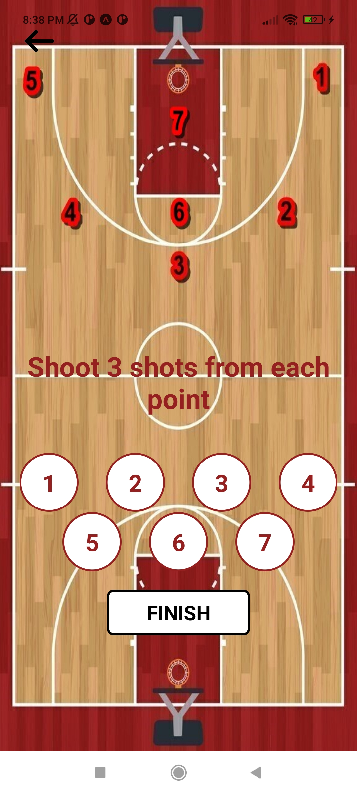

  
### Result after a training

    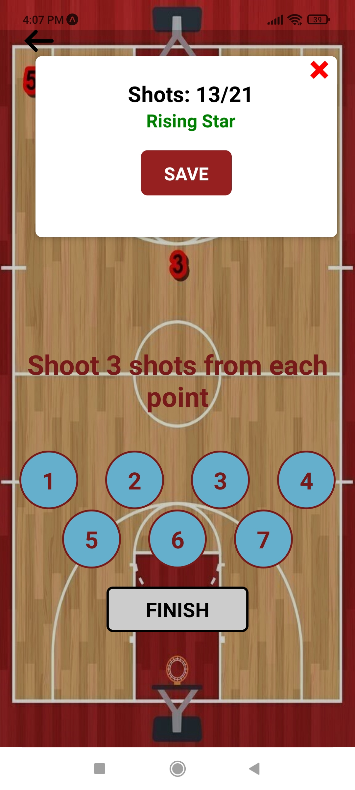

  

### Training History

    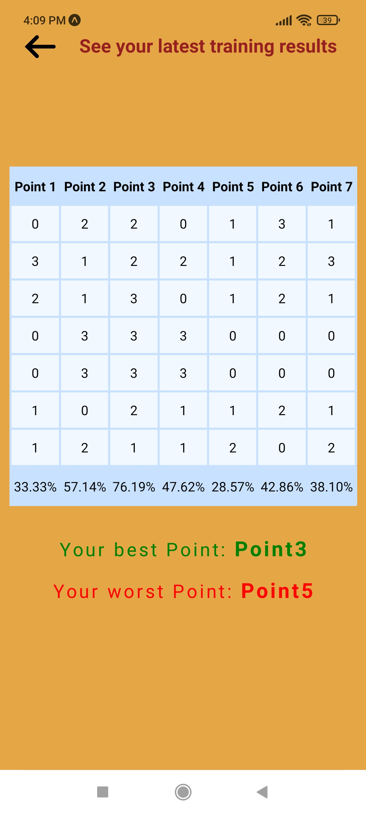

 

## Groups
In this mode we add our friends from the app, divide them into teams and create a Group in order for the 2 teams to keep a **history** of their matches. In addition to the history in the groups we also provide what is the **total score** of all the matches of the 2 teams and the **percentage of wins** of each team. The leader of the group, who is originally the creator of the group, is the one who can add a new score as well as do other actions such as change a team to a member, update the latest score, add a new person and make another leader.
### Divide Friend Into Teams

    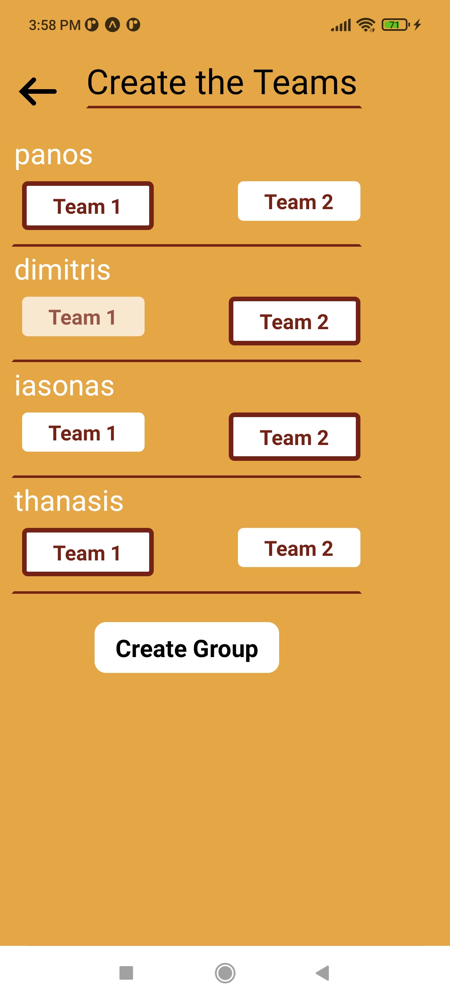

 

### Groups Main Screen

    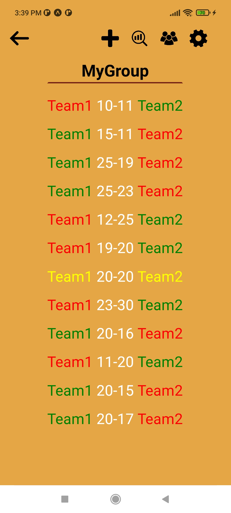

 

### Leader's Settings

    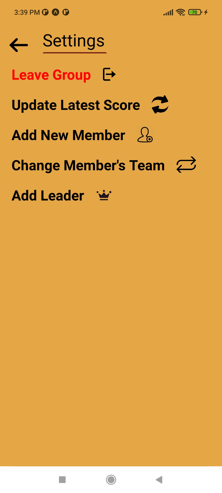

 

### Adding New Score

    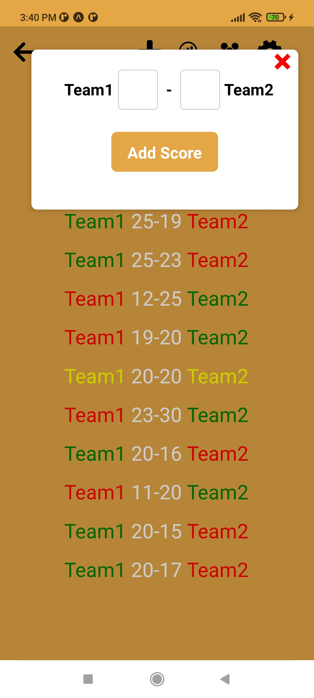

 

### Group Members

    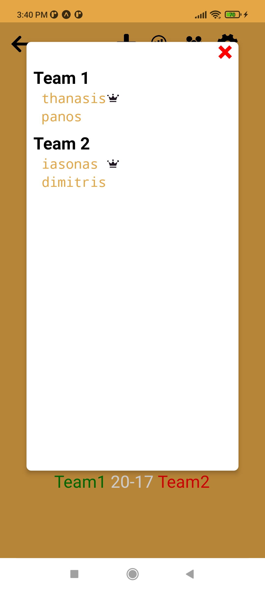

 

### Groups Statistics

    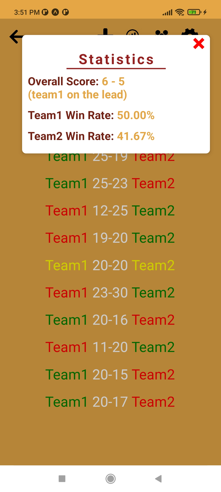

 

## Search Team Nearby
In this mode the user has the possibility to **search for a game near his/her area** and participate in it. A user can join an available game or create his own game for other users near his location to join. To create a game the user chooses exactly the place on the map the time and date where the game will take place in order to let other users know where and when to come.
### Game Creation

    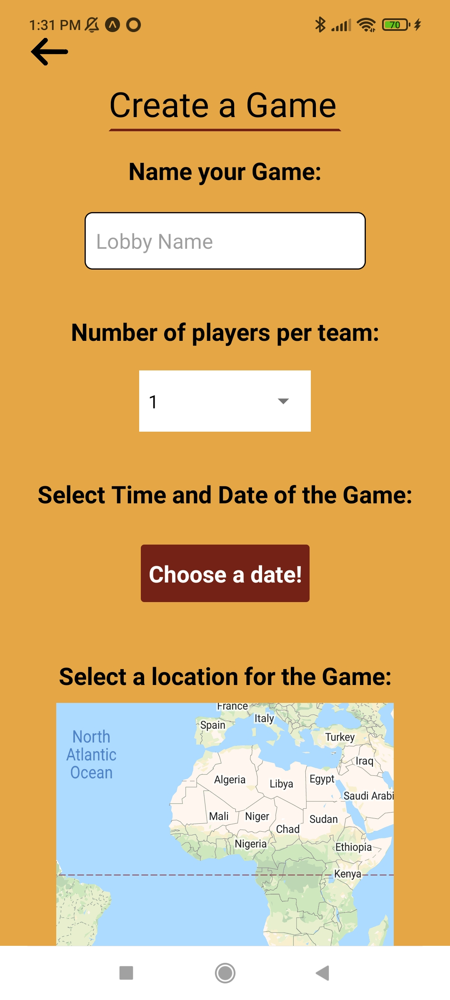

 

### Games at a Nearby Location

    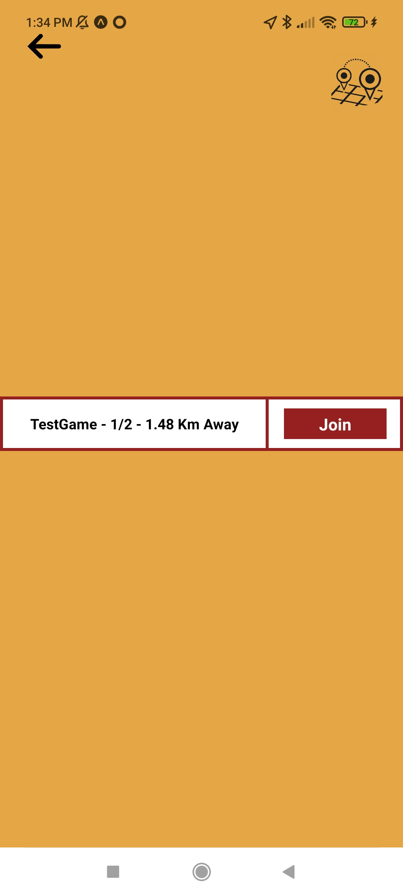

 

### Game Lobby

    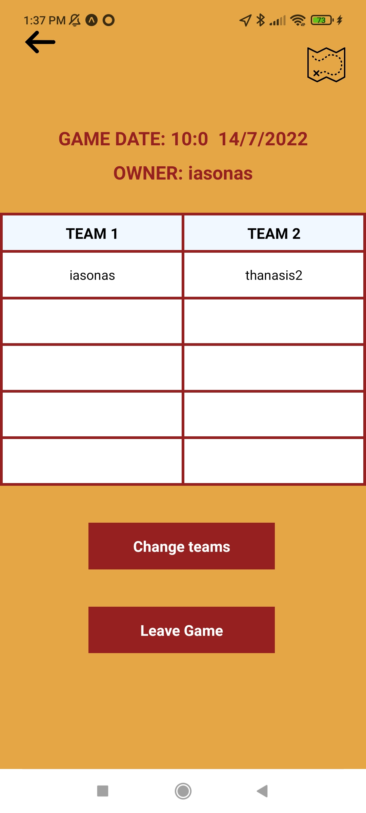

 

## Create Tournament
In this mode we add our friends, divide them into groups or as we wish or let the application do it (**matchmaking**) using the statistics from the friend ratings  and other metrics we have given from the register (weight, height and level which is amateur or professional). This function guides all teams up to the grand final. It shows for each team its members, eliminated teams and the history of the matches.
### Options When Creating a Tournament

    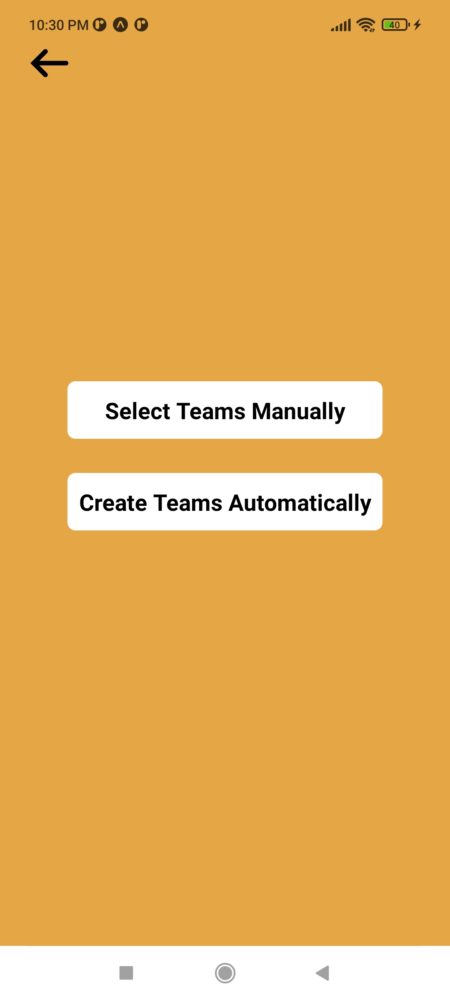

 

### Tournament Main Screen

    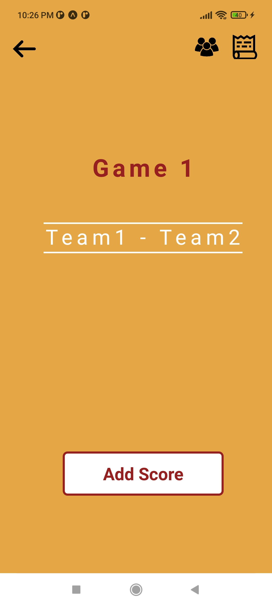

 

### Tournament History

    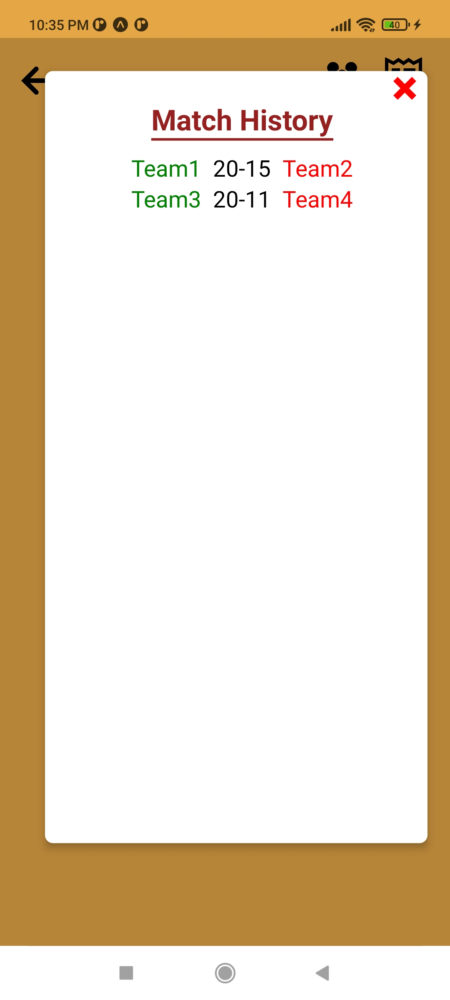

 

### Tournament Members

    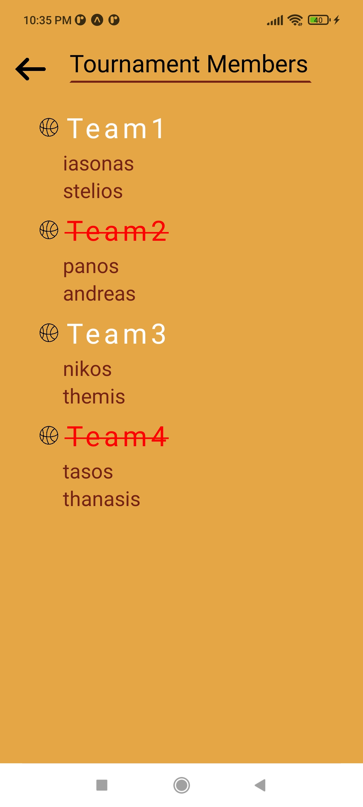

### Tournament Winner

    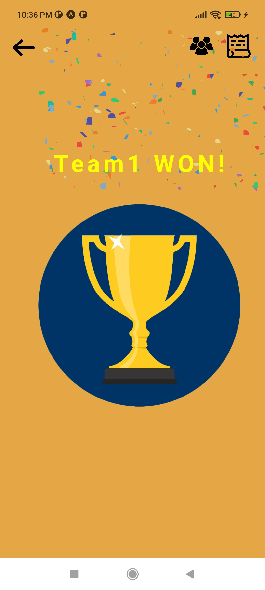

## Rate Friend
In this feature we have the opportunity to **rate the friends** we have from the app from 0 to 5 stars in the following categories:
- Blocks
- Defense
- 3 Points
- 2 Points 
- Rebounds
- Atheleticism
- Team Player
- Overall Score  

    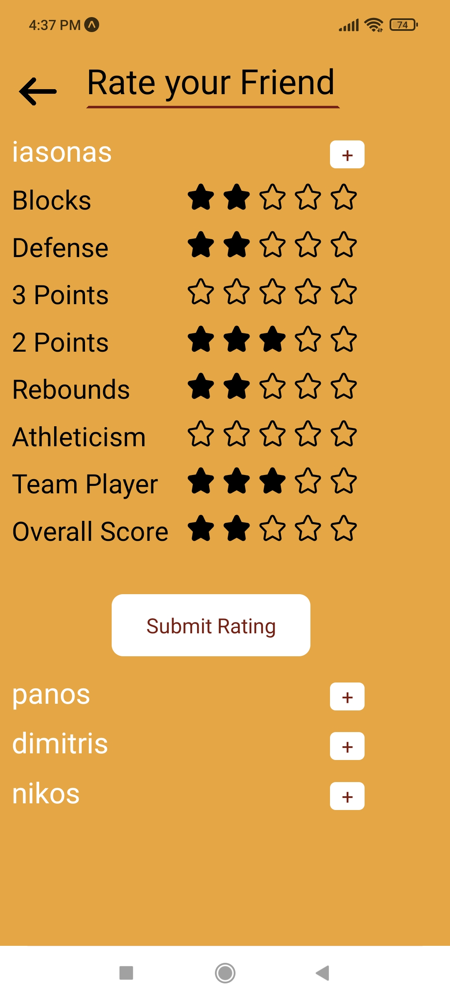

## More info about the app
A user can send a **friend request** to another user that uses the app. To test that our **matchmaking algorithm** works as expected we used **NBA players data** from **NBA2K20** and we sort these players into teams. 

## Technologies used in this project
- React Native
- Javascript
- React
- Firebase Firestore
- Node.js
- Expo